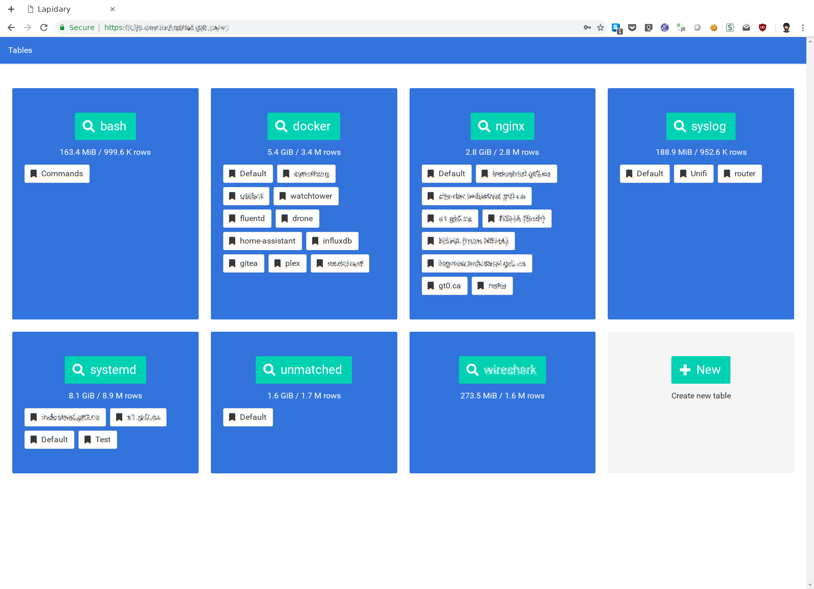
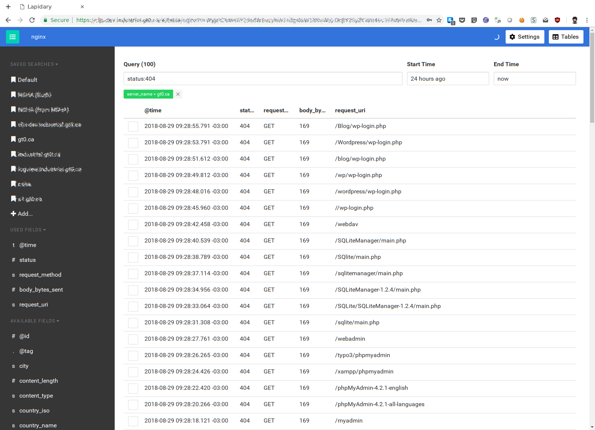

# Lapidary

A search engine for structured data using Postgres, with a similar syntax to Apache Lucene.  This is intended for small to medium sized centralized logging configurations.

Pull requests welcome, especially documentation!

[](https://circleci.com/gh/theasp/lapidary)

## Features

* Data is stored as JSON in PostgreSQL
* Lucene like search syntax
* Full text search

## Screenshots

### Tables


### Query


## Installation

### Docker

Using the [docker-compose.yml](docker-compose.yml) file from the repository, run:
```
docker-compose up
```

This will start PostgreSQL, Lapidary and fluentd.  You can log into Lapidary at http://localhost:8081 using the username admin and the password "ChangeMe!".  Fluentd is listening on 24230 for forward connections, and 5145 for syslog.

You can log a message using:
```
logger -n localhost -P 5145 "Hello Lapidary!"
```


## Configuration

## Reference

### Query String

### API

TODO: Currently not available

## Project Roadmap
